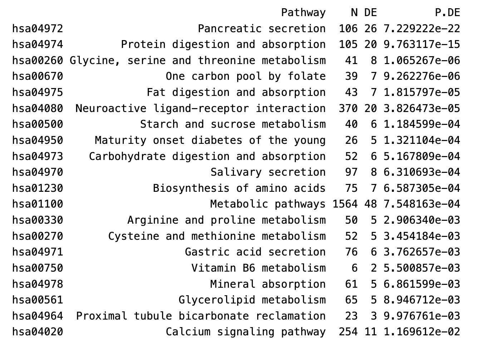

# Introduction

Pancreatic cancer remains one of the deadliest malignancies worldwide, with a five-year survival rate of less than 10% due to its aggressive nature, late diagnosis, and limited treatment options. Among pancreatic cancers, pancreatic adenocarcinoma (PAAD) accounts for the majority of cases and poses significant challenges to early detection and effective therapeutic intervention. Understanding the molecular mechanisms driving PAAD is essential for developing novel diagnostic markers and therapeutic targets to improve patient outcomes.

This study aims to identify genes that are differentially expressed between normal pancreatic tissue and pancreatic adenocarcinoma tissue, leveraging transcriptomic data from The Cancer Genome Atlas (TCGA) and the Genotype-Tissue Expression (GTEx) project. By integrating advanced bioinformatics approaches, we seek to uncover key biological processes, pathways, and molecular functions associated with PAAD development and progression.

Our research addresses the following key questions:

What genes are differentially expressed between normal pancreatic tissue and pancreatic adenocarcinoma tissue?
Which biological processes and pathways are enriched in the differentially expressed genes?
How do these findings contribute to our understanding of the molecular mechanisms underlying pancreatic adenocarcinoma?
Through rigorous data preprocessing, differential gene expression analysis, pathway enrichment analysis, and network inference, this project will provide insights into the complex biology of pancreatic adenocarcinoma, potentially identifying novel biomarkers and therapeutic targets. By stratifying data based on sex and diabetes status, we further aim to elucidate subgroup-specific molecular features that may refine our understanding of PAAD heterogeneity and its clinical implications.

# Methods & Result: TCGA VS GTEX

### Data Sources
- **TCGA (PAAD):** Pancreatic adenocarcinoma samples.
- **GTEx:** Normal tissue samples.

### Tools and Packages
- Differential expression analysis was conducted using **limma** and **voom**.
- Gene Ontology (GO) and KEGG pathway enrichment analyses were performed.

```{r, message=FALSE, eval = FALSE, warning=FALSE}

library(Biobase)
library(limma)
library(ggfortify)
library(biomaRt)
library(gplots)
library(SummarizedExperiment)
library('ggplot2')      # For plotting
library('reshape2')     # For data processing
library('visNetwork')
library('fgsea')
```

### Exploratory Data Analysis (EDA)
- **Sample Details:**
  - TCGA (179 cancer samples) with gene information for 34,032 genes.
  - GTEx (349 normal samples) with gene information for 31,530 genes.
  - Includes metadata on sex, age, diabetes, and alcohol history.

```{r, eval = FALSE}
## Load Data and Preprocess

# downloading data
gtex <- readRDS("gtex_pancreas.rds")
tcga <- readRDS("tcga_paad.rds")

# structure of both datasets
gtex
tcga
```


- **Processing Steps:**
  1. Batch effect detection.

```{r, eval = FALSE}
# checking sequencing platform
unique(colData(tcga)$tcga.gdc_platform)
names(colData(tcga))[1:5]
```
  2. Calculated TPM (transcripts per million) of genes.

```{r, eval = FALSE}
raw_counts <- assay(tcga, "raw_counts")
gene_lengths <- rowData(tcga)$bp_length/1000
rpk <- raw_counts/gene_lengths
scaling_factors <- colSums(rpk)
tpm <- sweep(rpk, 2, scaling_factors, FUN = "/") * 10^6
tpm[1, 0:5]
```
  3. Focused analysis on early stages (1–2).
```{r, eval = FALSE}
# filtering TCGA data to only include first and second grade tumors
keep_stages <- tcga@colData@listData$tcga.gdc_cases.diagnoses.tumor_stage %in%
  c("stage i", "stage ia", "stage ib", "stage iia", "stage iib")
dim(tcga)
tcga <- tcga[, keep_stages]
dim(tcga)

# defining a column that outlines the source: GTEX or TCGA
colData(gtex)$source <- "GTEX"
colData(tcga)$source <- "TCGA"
```

  4. Merge normal/Tumour genes, filtered genes with low counts.
```{r, eval = FALSE}
## Analysis for Normal vs Tumour

# intersection of columns (features of sample data)
common_cols <- intersect(names(colData(gtex)), names(colData(tcga)))

# identification of common genes for both GTEX and TCGA
common_genes <- intersect(rownames(assay(gtex, "logtpm")),
                          rownames(assay(tcga, "logtpm")))

# updating datasets by applying common genes and common columns filters
gtex_upd <- gtex[common_genes, ]
tcga_upd <- tcga[common_genes, ]
colData(gtex_upd) <- colData(gtex_upd)[, common_cols, drop = FALSE]
colData(tcga_upd) <- colData(tcga_upd)[, common_cols, drop = FALSE]

# merging
merged_logtpm <- cbind(assay(gtex_upd, "logtpm"), assay(tcga_upd, "logtpm"))
dim(merged_logtpm)
merged_colData <- as.data.frame(rbind(colData(gtex_upd), colData(tcga_upd)))
dim(merged_colData)

# genes will be filtered if they have very low counts (tpm < 1) in 25% of the samples
merged_exprs <- cbind(assay(gtex_upd, "raw_counts"), assay(tcga_upd, "raw_counts"))
merged_gene_lengths <- rowData(gtex_upd)$bp_length/1000
merged_rpk <- merged_exprs/merged_gene_lengths
merged_scaling_factors <- colSums(merged_rpk)
merged_tpm <- sweep(merged_rpk, 2, merged_scaling_factors, FUN = "/") * 10^6
keep <- rowSums(merged_tpm > 1) >= ncol(merged_tpm)/4
gtex_upd <- gtex_upd[keep, ]
tcga_upd <- tcga_upd[keep, ]
saveRDS(gtex_upd, file("gtex.rds"))
merged_exprs <- merged_exprs[keep, ]
sum(keep)
```
  5. Conducted principal component analysis (PCA).
```{r, eval = FALSE}
PCA <- prcomp(t(assay(tcga_filtered, "logtpm")))
p <- autoplot(PCA, data = as.data.frame(colData(tcga)),
              colour="tcga.gdc_cases.demographic.gender")
p
PCA <- prcomp(t(merged_logtpm[keep,]))
p <- autoplot(PCA, data = as.data.frame(rbind(colData(gtex_upd[keep,]), colData(tcga_upd[keep,]))), colour="source")
p

```

  
```{r, eval = FALSE}
PCA <- prcomp(t(merged_logtpm))
p <- autoplot(PCA, data = merged_colData, colour="source")
p
```

```{r}

```

#### PCA Interpretation

We can see the GTEX and TCGA are clearly separated into two clusters, especially in the PC1 Axis. It indicates there is major difference between the GTEX and TCGA dataset, which is a good sign for further differential analysis.

## Differential Expression Analysis

### Voom Mean-variance trend
```{r bla, echo=FALSE, eval = FALSE}
condition <- factor(merged_colData$source, levels=c("GTEX", "TCGA"))
design <- model.matrix(~ condition)
voomOutput <- voom(merged_exprs, design, plot=TRUE)

```
```{r}

```

#### Voom Interpretation:
The graph is as expected by statistical theory of variance, where variance decreases as count size increases.

### Volcano Plot
```{r volcano-plot, echo=FALSE, eval = FALSE}
sig <- ifelse(res$adj.P.Val < 0.05 & abs(res$logFC) > 2, yes="red", no="black")
plot(x=res$logFC, y=-log(res$adj.P.Val), xlab="log-fold-change", ylab="-log(FDR)",
     pch=21, col=sig, bty="l", main="Volcano plot", cex=0.8)

```


```{r}

```

#### Volcano Interpretation:
The graph does not show any concerning pattern and follow the lecture example. Plot shows significant number of differentially expressed genes between the TGCA and GTEX.


### MA Plot
```{r ma-plot, echo=FALSE, eval = FALSE}
sig = ifelse(res$adj.P.Val < 0.05 & abs(res$logFC) > 2, yes="red",no="black")
plot(x=res$AveExpr, y=res$logFC, xlab="Average log-expression", ylab="log-fold-change",
     pch=21,col=sig,bty="l", main="MA plot", cex=0.8)

```
```{r}
knitr::include_graphics("./MA.png")
```


#### MA plot Interpretation:
The graph does not show any concerning pattern and follow the lecture example. With steady logFC throughout all average log-expression. 


<!-- #### MA plot and Voom Interpretation: -->
<!-- The graphs are as expected as the examples shown in the class examples. Indicate no abnormalities. -->

## GO and KEGG Enrichment Analysis

### Gene Ontology (GO)
#### Over Expressed GO terms in TCGA
```{r go-analysis, eval = FALSE}
# Perform over-representation analyses for Gene Ontology terms using the limma package
go_tcga <- goana(up_tcga_ID, species="Hs")
# This is the list of top GO terms enriched for genes highly expressed in tcga
topGO(go_tcga, ontology = "BP")
```

```{r}

```

#### Over Expressed GO terms in GTEX
```{r, eval = FALSE}
go_gtex <- goana(up_gtex_ID, species="Hs")
# This is the list of top GO terms enriched for genes highly expressed in gtex
topGO(go_gtex, ontology = "BP")
```

```{r}

```


- **Immune Responses:** Terms such as "immune system process" and "leukocyte activation".
- **Cell Adhesion and Migration:** Terms include "cell adhesion" and "cell migration".
- **Homeostasis:** Includes chemical and nitric oxide signaling.

- **Upregulated Genes:** 3199 genes were significantly upregulated, including:
  - **ANXA8, FAM83A, MUC16, MET, NT5E, SLC2A1**.

- **Downregulated Genes:** 843 genes were significantly downregulated, including:
  - **CTRB2, IGFBP1, CPA1**.
  
### KEGG Pathways
#### Over expressed TCGA
```{r kegg-analysis, eval = FALSE}
# Perform over-representation analyses for KEGG pathways
kegg_tcga <- kegga(up_tcga_ID, species="Hs")
# This is the list of top KEGG pathwayss enriched for genes highly expressed in tcga
topKEGG(kegg_tcga)
```

```{r}

```

#### Over Expressed GTEX
```{r, eval = FALSE}
# Perform over-representation analyses for KEGG pathways
kegg_gtex <- kegga(up_gtex_ID, species="Hs")
# This is the list of top KEGG pathwayss enriched for genes highly expressed in gtex
topKEGG(kegg_gtex)
```

```{r}

```


- **Upregulated Pathways:** JAK-STAT, TGF-Beta, Citrate Cycle (TCA).
- **Downregulated Pathways:** Oxidative phosphorylation, ribosome.

## Network Analysis

### PANDA Networks

```{r network-analysis, eval = FALSE}
male_network_full <- read.table("output_males.txt", header=TRUE, stringsAsFactors=FALSE)
female_network_full <- read.table("output_females.txt", header=TRUE, stringsAsFactors=FALSE)
```

#### PANDA-TCGA NETWORK
```{r, eval = FALSE}
## This is the TCGA network
edges <- tcga_network
colnames(edges) <- c("from", "to", "value")
nodes       = data.frame(id = unique(as.vector(as.matrix(edges[,c(1,2)]))), 
                    label=unique(as.vector(as.matrix(edges[,c(1,2)]))))
nodes$group = ifelse(nodes$id %in% edges$from, "TF", "gene")
net <- visNetwork(nodes, edges, width = "100%")
net <- visGroups(net, groupname = "TF", shape = "triangle",
                 color = list(background = "purple", border="black"))
net <- visGroups(net, groupname = "gene", shape = "dot",       
                 color = list(background = "teal", border="black"))
visLegend(net, main="Legend", position="right", ncol=1) 
```

```{r}

```

#### PANDA CANCER VS NORMAL
```{r, eval = FALSE}
## This plots the edges that change the most in cancer vs normal
edges <- diffnet
colnames(edges) <- c("from", "to", "value")
edges$arrows = "to"   
edges$color  = ifelse(edges$value > 0, "green", "red")
edges$value  = abs(edges$value)
edges <- edges[order(edges$value, decreasing = TRUE), ]
edges <- edges[1:200,]
nodes       = data.frame(id = unique(as.vector(as.matrix(edges[,c(1,2)]))), 
                    label=unique(as.vector(as.matrix(edges[,c(1,2)]))))
nodes$group = ifelse(nodes$id %in% edges$from, "TF", "gene")
net <- visNetwork(nodes, edges, width = "100%")
net <- visGroups(net, groupname = "TF", shape = "triangle",
                 color = list(background = "purple", border="black"))
net <- visGroups(net, groupname = "gene", shape = "dot",       
                 color = list(background = "teal", border="black"))
visLegend(net, main="Legend", position="right", ncol=1) 
```

```{r}

```


```{r, eval = FALSE}
## This plots a bubble plot for the differentially expressed pathways


dat <- data.frame(fgseaRes)
# Settings
fdrcut <- 0.05 # FDR cut-off to use as output for significant signatures
dencol_neg <- "blue" # bubble plot color for negative ES
dencol_pos <- "red" # bubble plot color for positive ES
signnamelength <- 4 # set to remove prefix from signature names (2 for "GO", 4 for "KEGG", 8 for "REACTOME")
asp <- 3 # aspect ratio of bubble plot
charcut <- 100 # cut signature name in heatmap to this nr of characters
a <- as.character(dat$pathway) # 'a' is a great variable name to substitute row names with something more readable
for (j in 1:length(a)){
  a[j] <- substr(a[j], signnamelength+2, nchar(a[j]))
}
a <- tolower(a) # convert to lower case (you may want to comment this out, it really depends on what signatures you are looking at, c6 signatures contain gene names, and converting those to lower case may be confusing)
for (j in 1:length(a)){
  if(nchar(a[j])>charcut) { a[j] <- paste(substr(a[j], 1, charcut), "...", sep=" ")}
} # cut signature names that have more characters than charcut, and add "..."
a <- gsub("_", " ", a)
dat$NAME <- a
dat2 <- dat[dat[,"padj"]<fdrcut,]
dat2 <- dat2[order(dat2[,"padj"]),] 
dat2$signature <- factor(dat2$NAME, rev(as.character(dat2$NAME)))
sign_neg <- which(dat2[,"NES"]<0) #Up regulated in cancer
sign_pos <- which(dat2[,"NES"]>0)
signcol <- rep(NA, length(dat2$signature))
signcol[sign_neg] <- dencol_neg # text color of negative signatures
signcol[sign_pos] <- dencol_pos # text color of positive signatures
signcol <- rev(signcol) # need to revert vector of colors, because ggplot starts plotting these from below
g<-ggplot(dat2, aes(x=padj,y=signature,size=size))
g+geom_point(aes(fill=NES), shape=21, colour="white")+
  theme_bw()+ # white background, needs to be placed before the "signcol" line
  xlim(0,fdrcut)+
  scale_size_area(max_size=10,guide="none")+
  scale_fill_gradient2(low=dencol_neg, high=dencol_pos)+
  theme(axis.text.y = element_text(colour=signcol))+
  theme(aspect.ratio=asp, axis.title.y=element_blank()) # test aspect.ratio
```

```{r}

```

- Differential network analysis highlighted:
  - **Diabetes vs Non-Diabetes:** Over-regulation of PINX1.
  - **Sex Differences:** DEGs mostly on X/Y chromosomes.


## Result Discussion

## Single Gene Analysis

Upon conducting differential expression analysis comparing TCGA, that is, cancer samples, to the GTEx normal samples, using limma and voom, the plot of the final model mean-variance trend appeared not to display any concerning patterns, and the volcano plot indicated a large number of genes that are differentially expressed. A few of these differentially expressed genes will be discussed below.

Using the thresholds of a 0.05 adjusted p-value and a log fold change of 2, we found 3199 genes up-regulated in the Cancerous TCGA samples. Genes indicated as being upregulated included ANXA8 (logFC 6.08), FAM83A (logFC 8.52), KRT6A (logFC 3.27), MET (logFC 2.87), NT5E (logFC 4.48), and SLC2A1 (logFC 5.09). In a study(https://pmc.ncbi.nlm.nih.gov/articles/PMC10432876/#:~:text=During%20the%20data%20analysis%2C%20we,MUC16%2C%20NT5E%2C%20and%20SLC2A1) attempting to identify prognostic factors for pancreatic cancer, high expression of all of these genes were found to be linked with shorter survival. In addition, all of these genes were also found to affect this poor prognosis independently of each other. An overview of the function of these genes is provided in the table below, and the MET gene will be further discussed:
```{r}

```


The MET（https://www.ncbi.nlm.nih.gov/gene/4233） gene is located on the q arm of chromosome 7, and encodes a receptor for the Hepatocyte Growth Factor, upon binding to which the MET receptor activates pathways that regulate cell growth, survival, migration, and invasion. MET is a proto-oncogene that has been linked to multiple cancers, and specifically in pancreatic cancer, papers(https://www.ncbi.nlm.nih.gov/gene/4233, need many references?) suggest that the expression of MET is fundamental to the growth of the cancer cells, and increases the migration ability of cancer cells, leading to metastasis. MET has also been associated with cancer-related pain, via perineural invasion, and has been implicated in chemoresistance(Need first MET Paper).

Using the thresholds of a 0.05 adjusted p-value and a log fold change of -2, we found 843 genes down-regulated in the Cancerous TCGA samples. Genes indicated as being downregulated included  CPB1 (logFC -8.80), CPA1 (logFC -10.22), CPA2 (logFC -9.53), CTRB2 (logFC -9.60), and  CTRC (-8.71). In a study(https://www.sciencedirect.com/science/article/pii/S096074042200144X) attempting to identify genes relevant to drug development for the treatment of pancreatic cancer, these genes were found to be highly downregulated hub genes in protein-protein interaction networks, implicating these genes as critical in the tumor microenvironment. An overview of the function of these genes is provided in the table below, and the CTRB2 gene will be further discussed:

```{r}

```

The CTRB2 gene(https://www.ncbi.nlm.nih.gov/gene/440387) is located on the q arm of chromosome 16, and encodes a principal precursor involved in the activation of pancreatic enzymes, thus dysregulation of this gene results in imbalances in pancreatic enzyme activity, and inversions in this gene are associated with chronic inflammation of the pancreas. Specifically in relation to pancreatic cancer, low expression(https://genomemedicine.biomedcentral.com/articles/10.1186/s13073-020-00816-4) of CTRB2, via gene variations(https://www.sciencedirect.com/science/article/pii/S0002929721003384) or otherwise, confers risk of cancer. The relationship between CTRB2 and type 2 diabetes(https://genomemedicine.biomedcentral.com/articles/10.1186/s13073-020-00816-4), as well as chronic pancreatitis, risk factors for pancreatic cancer, may further explain the association of this gene with pancreatic cancer. 

## Conclusions

- Significant insights into pancreatic cancer pathways.
- Future research on MET and CTRB2 for therapeutic strategies.

# Methods & Result: Alcoholic Consumption
# Methods & Result: Diabetic VS Non-Diabetic
# Methods & Result: Male vs Female


# References

- Springer, Nature, PMC articles.

### Upregulation Papers

1. Posta, M., & Győrffy, B. Analysis of a large cohort of pancreatic cancer transcriptomic profiles to reveal the strongest prognostic factors. *Clin. Transl. Sci.* **16**, 1479–1491 (2023). https://doi.org/10.1111/cts.13563.

2. Xiao, X., Wan, Z., Liu, X., Chen, H., Zhao, X., Ding, R., et al. Screening of therapeutic targets for pancreatic cancer by bioinformatics methods. *Clin. Exp. Gastroenterol.* **55**, 420–425 (2023). https://doi.org/10.1055/a-2007-2715.

---

### MET Papers

1. Qin, T., Xiao, Y., Qian, W., Wang, X., Gong, M., Wang, Q., et al. HGF/c-Met pathway facilitates the perineural invasion of pancreatic cancer by activating the mTOR/NGF axis. *Cell Death Dis.* **13**, 4576 (2022). https://doi.org/10.1038/s41419-022-04799-5.

2. Li, C., Wu, J. J., Hynes, M., Welling, T. H., Pasca di Magliano, M., & Simeone, D. M. c-Met is a marker of pancreatic cancer stem cells and therapeutic target. *Gastroenterology* **141**, 791–806 (2011). https://doi.org/10.1053/j.gastro.2011.05.035.

3. Kim, J., Lee, T. S., Lee, M. H., Cho, I. R., Ryu, J. K., Kim, Y. T., et al. Pancreatic cancer treatment targeting the HGF/c-MET pathway: The MEK inhibitor trametinib. *Cancers* **16**, 1056 (2024). https://doi.org/10.3390/cancers16051056.

---

### Downregulation Paper

1. López de Maturana, E., Rodríguez, J. A., Alonso, L., Lao, O., Molina-Montes, E., Martín-Antoniano, I. A., et al. A multilayered post-GWAS assessment on genetic susceptibility to pancreatic cancer. *Genome Med.* **13**, 15 (2021). https://doi.org/10.1186/s13073-020-00816-4.

---

### CTRB2 Papers

1. López de Maturana, E., Rodríguez, J. A., Alonso, L., Lao, O., Molina-Montes, E., Martín-Antoniano, I. A., et al. A multilayered post-GWAS assessment on genetic susceptibility to pancreatic cancer. *Genome Med.* **13**, 15 (2021). https://doi.org/10.1186/s13073-020-00816-4.

2. Jermusyk, A., Zhong, J., Connelly, K. E., Petersen, G. M., Westlake, C. J., & Amundadottir, L. T. A 584 bp deletion in CTRB2 inhibits chymotrypsin B2 activity and secretion and confers risk of pancreatic cancer. *Am. J. Hum. Genet.* **108**, 1584–1593 (2021). https://doi.org/10.1016/j.ajhg.2021.08.007.

3. Xiao, Y., Zhang, B., Cloyd, J. M., Xu, G., Du, S., Mao, Y., & Pawlik, T. M. Gene signature and connectivity mapping to assist with drug prediction for pancreatic ductal adenocarcinoma. *Surg. Oncol.* **44**, 101849 (2022). https://doi.org/10.1016/j.suronc.2022.101849.
